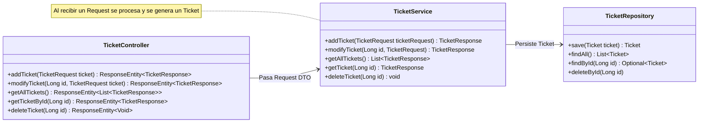

# TicketManager API


---

### 🚀 Descripción del proyecto
Una API REST que está diseñada para administrar tareas académicas y tickets de soporte técnico. El proyecto está enfocado principalmente en: garantizar un desacoplamiento estricto de capas mediante DTOs, persistir de forma segura los datos para ofrecer una API consistente y confiable.

### ⚡ Cómo probar el proyecto
Paso 1:
```
git clone https://github.com/DevNeno/TicketManager.git
cd TicketManager
./mvnw clean package -DskipTests
docker compose up --build
```
Paso 2:\
Ir a la [documentación interactiva de la API](http://localhost:8080/swagger-ui/index.html).

### 🧠 Buenas Prácticas y Calidad de Código
Este proyecto se desarrolló bajo normas estrictas:

* **Advertencias como errores (`-Werror`):** Todo el código compila sin advertencias. Cualquier advertencia del compilador se trata directamente como un error, lo que impulsa la mitigación de fallas de lógica antes de la implementación.
* **Desacoplamiento de capas (DTOs):** Uso estricto de Objetos de Transferencia de Datos para separar la persistencia de la capa de los controladores.
* **Manejo global de excepciones:** Uso de Manejador global de excepciones(`Global Exception Handler`) para poder retornar un mensaje personalizado en caso de ocurrir excepciones.

### 🛠️ Tecnologías
* **Backend:** Java 21, Spring Boot 4.0.6
* **Database:** MySQL

### 📊 Diagrama de Arquitectura



